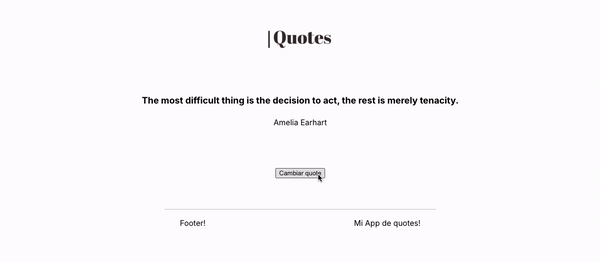

# Actividades

**Ahora es tu turno!**\
\
Tu objetivo será crear una app de Quotes como la siguiente:\

## Requisitos

Debes cumplir los siguientes requisitos:

- [ ] La app debe estar dividida en 3 secciones: header, main y footer.
- [ ] Debe tener 3 componentes:
  - [ ] Componente Header: debe cargar la imagen alojada en assets/logo.png.
  - [ ] Componente Footer: debe renderizar siempre la palabra Footer! y recibirá por prop un texto dinámico.
  - [ ] Componente Quote: debe mostrar la información de una quote obtenida al azar del archivo `data.json`.
- [ ] Debe haber un botón (sin componentizar) que al clickearlo cambie a una quote nueva al azar, actualizando el contenido del componente Quote.
- [ ] Typar las props utilizando PropTypes (si no lo haces eslint lo resaltará).

## Recursos y aclaraciones

- Repo inicial para tener un punto del cual partir: [link al proyecto de github].\
Recuerda ingresar al proyecto, correr `npm install` y luego `npm run dev`.
- El listado de quotes puedes encontrarlo en el archivo `data.json`
- No es necesario estilar nada, pero si quieres hacerlo adelante!
